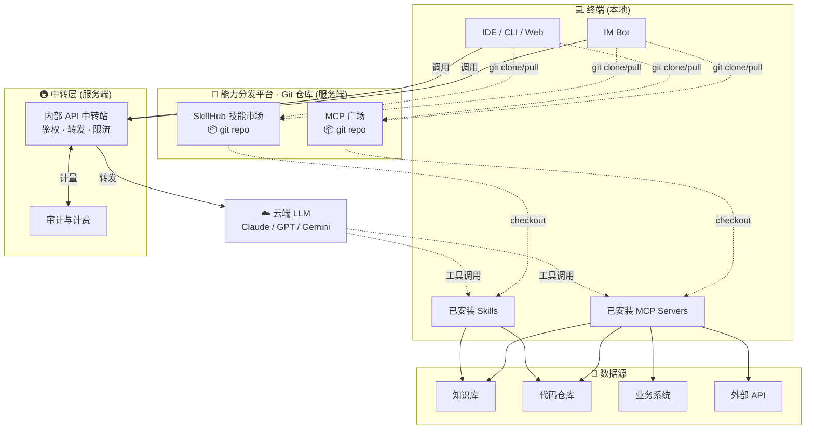
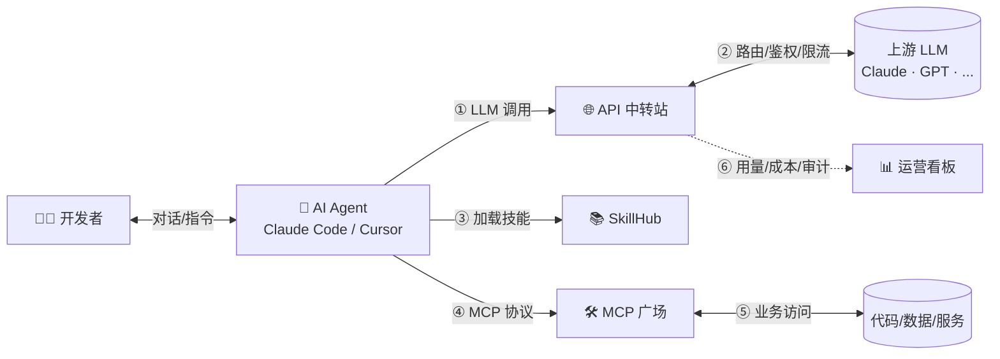

# AI 工程化与安全探索

<div class="pt-12">
  <span class="px-2 py-1 rounded cursor-pointer" hover="bg-white bg-opacity-10">
    Claude -p · 代码 MCP · 工程化 · 安全
  </span>
</div>

<div class="abs-br m-6 text-xs opacity-50">
  2026 · 技术分享
</div>

---
layout: section
---

# Part 1

## Claude `-p` 与 Claude 原生功能讲解

---

# Claude `-p` 与 Claude 原生功能讲解

<div class="text-center text-sm opacity-70">

Claude 命令行用法大家都很熟悉了，主要分享 <span style="color:#c084fc">**`-p`**</span> 对程序开发的意义。

</div>

<div class="grid grid-cols-2 gap-4 mt-3" style="font-size: 0.85em;">

<div class="p-4 rounded-xl" style="background: linear-gradient(135deg, rgba(168, 85, 247, 0.10), rgba(59, 130, 246, 0.10)); border: 1px solid rgba(168, 85, 247, 0.35);">

### 🔌 完美集成现有框架与流程

`-p` 没有 UI、退出即结束 —— **天然适合作为流水线的一个环节**。

<v-clicks>

- 🔁 **CI / CD**：PR 风险评估、Changelog
- 🪝 **Git Hooks**：commit 校验、pre-push 扫描
- 📋 **Code Review**：自动审阅 + 评论
- ⏰ **定时任务**：日报、周报、依赖升级

</v-clicks>

</div>

<div class="p-4 rounded-xl" style="background: linear-gradient(135deg, rgba(34, 197, 94, 0.10), rgba(16, 185, 129, 0.10)); border: 1px solid rgba(34, 197, 94, 0.35);">

### 🌐 搭建服务器对外提供本机能力

把 Claude 包装成 **HTTP 服务**，让其他系统也能调用本机 AI 能力。

<v-clicks>

- 🏢 **企业内部 API**：统一封装供其他服务
- 🤖 **AI 中转网关**：路由 / 限流 / 审计
- 🛠️ **业务侧嵌入**：代码评审、文档生成
- 📊 **批处理服务**：定时大任务，结果入库

</v-clicks>

</div>

</div>

<v-click>

```bash
# 一句话集成：把 -p 塞进任何 shell 流程
git diff origin/main | claude -p "评审此 PR 的潜在风险" --output-format json | jq '.risk'
```

</v-click>

<div v-click class="mt-2 text-center text-sm opacity-80">

> 💡 **`-p` 的本质** —— 把 AI 从"对话产品"变成 **"可编程的原子能力"**，像 `grep` / `curl` 一样嵌入任何流程。

</div>

---
layout: two-cols
---

# Claude `-p` 是什么？

**Claude `-p`** 是 Anthropic 官方提供的 **非交互式（pipe）模式**，用于在终端中以单次调用方式执行任务，适合脚本化与批处理场景。

**核心特性：**

- 📝 **单次提示**：执行后立即返回结果
- 🔗 **管道友好**：可与其他 CLI 工具组合
- 🚫 **无会话保持**：不保留上下文
- ⚡ **可编程**：便于 CI/CD、自动化

::right::

# 典型使用场景

```bash {all|2|4|6|8}
# 1. 基础单次调用
claude -p "用一句话介绍 Go 的 Goroutine"

# 2. 文件内容分析
cat error.log | claude -p "总结错误的关键模式"

# 3. 代码评审
git diff main..feature | claude -p "审查此 PR 的潜在风险"

# 4. 批量处理
find ./src -name "*.js" | head -20 | claude -p "提取所有导出的函数名"
```

<v-click>

**⚠️ 关键限制**：
- 无 Tool Use（除非显式开启 `--allowedTools`）
- 无项目上下文（需手动传入）
- 无交互追问

</v-click>

---

# Claude `-p` vs 交互模式

<div class="grid grid-cols-2 gap-6">

<div>

### 🖥️ 交互模式 (默认)

```bash
$ claude
╭─────────────────────────────────────╮
│ ✻ Welcome to Claude Code!           │
│                                       │
│ > 帮我重构这个模块...                 │
╰─────────────────────────────────────╯
```

- ✅ 多轮对话、上下文保持
- ✅ 工具调用、文件编辑
- ✅ 计划确认与中断
- ✅ 项目级记忆（CLAUDE.md）

</div>

<div>

### 📟 `-p` 管道模式

```bash
$ echo "解释 defer" | claude -p
Defer 是 Go 中的延迟语句...
[exit 0]
```

- ✅ 单次执行、退出码 0/1
- ✅ 流式输出 / 静默模式
- ✅ 适合 CI、cron、shell 管道
- ❌ 无工具，无上下文

</div>

</div>

<v-click>

<div class="mt-6 p-4 rounded bg-blue-500 bg-opacity-10 border-l-4 border-blue-500">

💡 **选择建议**：交互模式用于探索与开发，`-p` 用于生产自动化。两者可在同一工作流中混用。

</div>

</v-click>

---

# 实战：`-p` 进阶用法

<div class="abs-tr m-6 text-xs opacity-50">

Part 1 · `-p` 进阶 · 案例 1 / 3

</div>

<pre style="background: rgba(15,23,42,0.85); border: 1px solid rgba(99,102,241,0.3); border-radius: 10px; padding: 0.7rem 0.95rem; margin: 0.5rem 0 0 0; font-size: 0.78em; line-height: 1.5; color: rgba(226,232,240,0.92); font-family: 'JetBrains Mono', 'Fira Code', 'Consolas', monospace; overflow: auto; box-shadow: 0 4px 16px rgba(0,0,0,0.3);"><span style="color: #6b7280;"># 允许工具调用（受限模式）</span>
<span style="color: #c4b5fd;">claude</span> -p <span style="color: #86efac;">"修复 lint 错误"</span> --allowedTools <span style="color: #fcd34d;">"Read,Edit,Bash(npm run lint)"</span>

<span style="color: #6b7280;"># 指定模型与系统提示</span>
<span style="color: #c4b5fd;">claude</span> -p <span style="color: #86efac;">"总结"</span> --model <span style="color: #f9a8d4;">claude-opus-4-8</span> --system-prompt <span style="color: #86efac;">"你只用 3 句话回答"</span>

<span style="color: #6b7280;"># JSON 输出（便于程序解析）</span>
<span style="color: #c4b5fd;">claude</span> -p <span style="color: #86efac;">"分析这段代码"</span> --output-format json | <span style="color: #c4b5fd;">jq</span> <span style="color: #86efac;">'.content'</span>

<span style="color: #6b7280;"># 管道结合 jq 做 CI 守门</span>
<span style="color: #c4b5fd;">gh</span> pr diff | <span style="color: #c4b5fd;">claude</span> -p <span style="color: #86efac;">"评估 PR 风险等级 1-5"</span> --output-format json \
  | <span style="color: #c4b5fd;">jq</span> -e <span style="color: #86efac;">'.score &lt;= 3'</span> || (<span style="color: #c4b5fd;">echo</span> <span style="color: #86efac;">"❌ 高风险"</span>; <span style="color: #c4b5fd;">exit</span> 1)

<span style="color: #6b7280;"># 多文件批量审查</span>
<span style="color: #c4b5fd;">for</span> f in $(<span style="color: #c4b5fd;">git</span> diff --name-only HEAD~1); <span style="color: #c4b5fd;">do</span>
  <span style="color: #c4b5fd;">claude</span> -p <span style="color: #86efac;">"评审 $f 的改动"</span> &lt; <span style="color: #fcd34d;">"$f"</span> &gt;&gt; review.md
<span style="color: #c4b5fd;">done</span></pre>

<v-click>

<div class="mt-2 p-2 rounded bg-orange-500/10 border-l-4 border-orange-500 text-sm">

🎯 **生产模式三要素**：显式 `--allowedTools` 控制权限 · `--output-format json` 便于解析 · 用 `jq` 做断言与失败门禁

</div>

</v-click>

---

# 实战：`-p` 进阶用法

<div class="abs-tr m-6 text-xs opacity-50">

Part 1 · `-p` 进阶 · 案例 2 / 3

</div>

<div class="grid grid-cols-2 gap-4 mt-2" style="font-size: 0.78em;">

<div>

<div class="text-xs opacity-60 mb-1">🖥️ 服务端：把 <code>claude -p</code> 包成 HTTP 接口</div>

```python
from flask import Flask, request, jsonify
import subprocess

app = Flask(__name__)

@app.route("/v1/ask", methods=["POST"])
def ask():
    data = request.json
    result = subprocess.run(
        ["claude", "-p", data["prompt"],
         "--output-format", "json",
         "--allowedTools", "Read,Edit"],
        capture_output=True, text=True, timeout=60
    )
    return jsonify({
        "answer":   result.stdout,
        "exit_code": result.returncode
    })

app.run(host="0.0.0.0", port=5000)
```

</div>

<div>

<div class="text-xs opacity-60 mb-1">📞 客户端：任意语言、任意场景</div>

```bash
# 业务后端 / IM Bot / CI 流水线
curl -X POST http://host:5000/v1/ask \
  -H "Content-Type: application/json" \
  -d '{"prompt":"评审这个 PR 的风险等级 1-5"}'
```

```javascript
// Node.js 也行,只发 HTTP
const r = await fetch("http://host:5000/v1/ask", {
  method: "POST",
  headers: { "Content-Type": "application/json" },
  body: JSON.stringify({ prompt: "总结这段代码" })
});
const { answer } = await r.json();
```

</div>

</div>

<v-click>

<div class="mt-3 p-3 rounded-lg bg-emerald-500/10 border-l-4 border-emerald-500 text-sm">

🎯 **为什么需要 HTTP 包装？**

- 🔌 **跨语言接入** — 业务后端、IM Bot、CI 无需装 Claude Code CLI
- 🛡️ **集中管控** — 统一鉴权、限流、审计,集中走内部 API 中转
- 🔁 **能力复用** — 一处实现,所有调用方共享同一套工具与系统提示

</div>

</v-click>

<v-click>

<div class="mt-2 p-2 rounded bg-amber-500/10 border-l-4 border-amber-500 text-xs">

⚠️ **生产注意**：`subprocess.run` 同步阻塞 → 用 `gunicorn + 任务队列`；长任务 → 改 `claude -p --stream` 流式返回；务必捕获 `CalledProcessError` 返回 5xx，避免吞错。

</div>

</v-click>

---

# 实战：`-p` 进阶用法

<div class="abs-tr m-6 text-xs opacity-50">

Part 1 · `-p` 进阶 · 案例 2 / 3 · 实际效果

</div>

<div style="position: absolute; top: 13%; left: 3%; right: 3%; bottom: 4%; display: flex; flex-direction: column; align-items: center; justify-content: center;">


<div class="text-center text-sm opacity-75 mt-4" style="max-width: 80%;">

📸 实际效果：<b>Postman</b> 调 <code style="background: rgba(99,102,241,0.15); padding: 1px 6px; border-radius: 4px;">POST localhost:5000/v1/ask</code> · Flask 收到后 <code style="background: rgba(99,102,241,0.15); padding: 1px 6px; border-radius: 4px;">subprocess → claude -p</code> · 生成的 Go 代码以 JSON 回传

</div>

</div>

---

# 实战：`-p` 进阶用法

<div class="abs-tr m-6 text-xs opacity-50">

Part 1 · `-p` 进阶 · 案例 3 / 3

</div>

<div class="grid grid-cols-5 gap-4 mt-1" style="height: calc(100% - 80px);">

<div class="col-span-3" style="display: flex; align-items: center; justify-content: center;">


</div>

<div class="col-span-2" style="font-size: 0.72em; display: flex; flex-direction: column; gap: 0.5rem; justify-content: center;">

<div class="p-3 rounded-lg" style="background: rgba(16, 185, 129, 0.10); border-left: 3px solid #10b981;">

<div style="font-weight: 600; color: #34d399; margin-bottom: 0.3rem;">🟢 方式一：本地 Claude Code</div>

- **Skill**：本机 `/mnt/skills/*.md` 文件
- **MCP**：本机 stdio 子进程
- **数据**：不出本机，零网络泄露
- **多轮**：客户端协调，反复调 API
- **适合**：开发者本机编码、调试

</div>

<div class="p-3 rounded-lg" style="background: rgba(99, 102, 241, 0.10); border-left: 3px solid #6366f1;">

<div style="font-weight: 600; color: #a5b4fc; margin-bottom: 0.3rem;">🟣 方式二：HTTP API + 后端托管</div>

- **Skill**：Anthropic 控制台账户配置
- **MCP**：远程 HTTP/SSE MCP Server
- **数据**：过境 Anthropic 后端
- **多轮**：后端内部完成，客户端只等一次
- **适合**：SaaS 集成、后端服务

</div>

<div class="p-2 rounded bg-orange-500/10 border-l-4 border-orange-500">

💡 **选型口诀**：**数据敏感 + 本地资源** → 方式一；**跨端集成 + 远程 SaaS** → 方式二。

</div>

</div>

</div>

<v-click>

<div class="text-center text-xs opacity-60 mt-2">

📂 图源：<code>public/files/remote_claude_code.svg</code> · 完整 8 项差异表见原图底部

</div>

</v-click>

---
layout: section
---

# Part 2

## 代码知识图谱工具对比

<div class="text-2xl mt-4 opacity-80 tracking-wide">

GitNexus &nbsp;⚔️&nbsp; CodeGraph

</div>

<div class="text-sm mt-2 opacity-60">

深度分析 · 选型指南

</div>

<div class="abs-br m-6 text-xs opacity-50">

Part 2 of 4

</div>

---
layout: two-cols
---

<div class="pr-4">

<div class="text-center mb-4">

# 🌌 GitNexus

</div>

<div class="text-center text-sm opacity-60 mb-6 italic">

*代码宇宙的"城市规划图"*

</div>

<div class="p-4 rounded-lg" style="background: linear-gradient(135deg, rgba(168, 85, 247, 0.10), rgba(236, 72, 153, 0.10)); border-left: 3px solid #a855f7;">

> **主打**：深度代码理解 · 服务端重型分析

</div>

### 🧭 核心能力

- **Process** — 执行流追踪
- **Leiden 聚类** — 自动识别模块边界
- **影响半径** — 改动爆炸半径分析
- **Web UI** — Sigma.js 可视化图谱

### 💾 存储引擎

<div class="mt-2 text-sm opacity-80">

`LadybugDB` · 图数据库 + WASM

</div>

### 🎯 适用场景

<v-clicks>

- 🏛️ 大型遗留项目探索
- 📐 架构审查 · Wiki 自动生成
- 🔍 PR 影响评估

</v-clicks>

</div>

::right::

<div class="pl-4">

<div class="text-center mb-4">

# 🛰️ CodeGraph

</div>

<div class="text-center text-sm opacity-60 mb-6 italic">

*代码世界的"GPS 导航"*

</div>

<div class="p-4 rounded-lg" style="background: linear-gradient(135deg, rgba(59, 130, 246, 0.10), rgba(16, 185, 129, 0.10)); border-left: 3px solid #3b82f6;">

> **主打**：效率与成本 · 客户端轻量同步

</div>

### ⚡ 核心能力

- **一键 init** — 自动配置 Claude Code / Cursor
- **OS 监听** — 文件变化热重载
- **Token 节省** — 基准 **-57%** · 成本 **-35%**
- **极简存储** — SQLite + FTS5

### 💾 存储引擎

<div class="mt-2 text-sm opacity-80">

`SQLite + FTS5` · 扁平化索引

</div>

### 🎯 适用场景

<v-clicks>

- 🤖 频繁使用 AI 编程助手
- 💸 追求低 API 成本、快响应
- 🚀 快速集成到现有工作流

</v-clicks>

</div>

---

# 📊 关键能力对比

<div class="text-center text-sm opacity-60 mb-3 italic">

*看清差异 · 按需选择*

</div>

<table style="font-size: 0.78em; table-layout: fixed; width: 92%; margin: 0 auto;">
<colgroup>
<col style="width: 26%;" />
<col style="width: 37%;" />
<col style="width: 37%;" />
</colgroup>
<thead>
<tr>
<th align="left">维度</th>
<th align="center">🌌 <strong>GitNexus</strong></th>
<th align="center">🛰️ <strong>CodeGraph</strong></th>
</tr>
</thead>
<tbody>
<tr>
<td align="left"><strong>核心定位</strong></td>
<td align="center">深度理解</td>
<td align="center">效率优先</td>
</tr>
<tr>
<td align="left"><strong>存储引擎</strong></td>
<td align="center"><code>LadybugDB</code></td>
<td align="center"><code>SQLite + FTS5</code></td>
</tr>
<tr>
<td align="left"><strong>增量更新</strong></td>
<td align="center"><span style="color:#ef4444">手动 re-analyze</span></td>
<td align="center"><span style="color:#10b981">实时监听</span></td>
</tr>
<tr>
<td align="left"><strong>可视化</strong></td>
<td align="center">✅ Web UI</td>
<td align="center">—</td>
</tr>
<tr>
<td align="left"><strong>安装体验</strong></td>
<td align="center">CLI + 浏览器</td>
<td align="center"><span style="color:#10b981">一键 init</span></td>
</tr>
<tr>
<td align="left"><strong>Token / 成本</strong></td>
<td align="center">—</td>
<td align="center"><strong style="color:#10b981">-57% / -35%</strong></td>
</tr>
</tbody>
</table>

<div v-click class="mt-3 text-center text-sm">

🎯 **GitNexus** 让你"看清全貌" · **CodeGraph** 让你"省时省钱"

</div>

---

# 🎯 选型建议

<div class="text-center text-sm opacity-60 mb-8 italic">

*没有银弹 · 只有取舍*

</div>

<div class="grid grid-cols-2 gap-6 mt-4">

<div class="p-6 rounded-xl" style="background: linear-gradient(135deg, rgba(168, 85, 247, 0.12), rgba(236, 72, 153, 0.12)); border: 1px solid rgba(168, 85, 247, 0.4);">

### 🌌 选 GitNexus

- 🏛️ 探索大型遗留项目
- 📐 生成架构文档 (Wiki)
- 🔍 深度 PR 影响评估
- 🎨 喜欢拖拽可视化分析

</div>

<div class="p-6 rounded-xl" style="background: linear-gradient(135deg, rgba(59, 130, 246, 0.12), rgba(16, 185, 129, 0.12)); border: 1px solid rgba(59, 130, 246, 0.4);">

### 🛰️ 选 CodeGraph

- 🤖 重度使用 Claude Code / Cursor
- 💸 想省 API 成本
- ⚡ 快速集成现有工作流
- 🚫 不需要复杂可视化

</div>

</div>

<div v-click class="mt-8 text-center">

<div class="inline-block px-8 py-4 rounded-xl" style="background: linear-gradient(135deg, rgba(34, 197, 94, 0.15), rgba(59, 130, 246, 0.15)); border: 1px solid rgba(34, 197, 94, 0.5);">

<div class="text-xs opacity-60 mb-1">🎮 在线体验 Demo</div>

<div class="text-lg font-semibold" style="color: #4ade80;">

http://172.17.141.10:8004/

</div>

</div>

</div>

---
layout: section
---

# Part 3

## AI 工程化探索

## （内部中转站 · SkillHub · MCP 广场）

---

# AI 工程化全景视图

<div class="abs-tr m-6 text-xs opacity-50">

Part 3 · 全景视图

</div>

<div style="position: absolute; top: 8%; left: 0; right: 0; bottom: 4%; display: flex; align-items: center; justify-content: center;">



</div>

<div v-click style="position: absolute; bottom: 1%; left: 0; right: 0; text-align: center; font-size: 0.85em; opacity: 0.8;">

💡 双流架构 · **请求流**（终端 → 中转 → 云 LLM） + **分发流**（市场 → 终端安装）

</div>

---

# 🚇 内部 API 中转站

<div class="abs-tr m-6 text-xs opacity-50">

Part 3 · 内部 API 中转站

</div>

<div style="position: absolute; top: 17%; left: 3%; right: 51%; bottom: 5%;">

<div style="background: linear-gradient(135deg, rgba(99,102,241,0.18), rgba(168,85,247,0.08));
            border: 1px solid rgba(99,102,241,0.35);
            border-radius: 12px;
            padding: 0.7rem 1rem;
            margin-bottom: 0.7rem;
            display: flex; align-items: center; gap: 0.7rem;
            box-shadow: 0 2px 12px rgba(99,102,241,0.12);">
  <span style="font-size: 1.6em; filter: drop-shadow(0 0 6px rgba(165,180,252,0.4));">🛡️</span>
  <div>
    <div style="font-weight: 600; font-size: 1.05em; color: rgba(199,210,254,1); letter-spacing: 0.02em;">统一 LLM API 网关</div>
    <div style="font-size: 0.75em; opacity: 0.7; margin-top: 2px;">屏蔽底层模型差异 · 一套代码多模型</div>
  </div>
</div>

<div class="grid grid-cols-2 gap-2.5" style="font-size: 0.78em;">

<div style="background: rgba(30,41,59,0.55); border: 1px solid rgba(99,102,241,0.28); border-radius: 9px; padding: 0.55rem 0.7rem;">
  <div style="display: flex; align-items: center; gap: 0.4rem; margin-bottom: 0.3rem;">
    <span style="font-size: 1.15em;">🔐</span>
    <span style="font-weight: 600; color: rgba(165,180,252,1); font-size: 0.95em;">统一鉴权</span>
  </div>
  <div style="opacity: 0.75; font-size: 0.92em; line-height: 1.35; margin-bottom: 0.35rem;">单点登录 + 部门配额</div>
  <div style="color: rgba(134,239,172,0.95); font-size: 0.82em; padding-top: 0.3rem; border-top: 1px dashed rgba(255,255,255,0.1);">✦ 降低接入门槛</div>
</div>

<div style="background: rgba(30,41,59,0.55); border: 1px solid rgba(99,102,241,0.28); border-radius: 9px; padding: 0.55rem 0.7rem;">
  <div style="display: flex; align-items: center; gap: 0.4rem; margin-bottom: 0.3rem;">
    <span style="font-size: 1.15em;">🔀</span>
    <span style="font-weight: 600; color: rgba(165,180,252,1); font-size: 0.95em;">多模型路由</span>
  </div>
  <div style="opacity: 0.75; font-size: 0.92em; line-height: 1.35; margin-bottom: 0.35rem;">Claude / GPT / Gemini / 自研</div>
  <div style="color: rgba(134,239,172,0.95); font-size: 0.82em; padding-top: 0.3rem; border-top: 1px dashed rgba(255,255,255,0.1);">✦ 一套代码多模型</div>
</div>

<div style="background: rgba(30,41,59,0.55); border: 1px solid rgba(99,102,241,0.28); border-radius: 9px; padding: 0.55rem 0.7rem;">
  <div style="display: flex; align-items: center; gap: 0.4rem; margin-bottom: 0.3rem;">
    <span style="font-size: 1.15em;">🌊</span>
    <span style="font-weight: 600; color: rgba(165,180,252,1); font-size: 0.95em;">流式聚合</span>
  </div>
  <div style="opacity: 0.75; font-size: 0.92em; line-height: 1.35; margin-bottom: 0.35rem;">SSE + 断点续传</div>
  <div style="color: rgba(134,239,172,0.95); font-size: 0.82em; padding-top: 0.3rem; border-top: 1px dashed rgba(255,255,255,0.1);">✦ 优化长文本体验</div>
</div>

<div style="background: rgba(30,41,59,0.55); border: 1px solid rgba(99,102,241,0.28); border-radius: 9px; padding: 0.55rem 0.7rem;">
  <div style="display: flex; align-items: center; gap: 0.4rem; margin-bottom: 0.3rem;">
    <span style="font-size: 1.15em;">💰</span>
    <span style="font-weight: 600; color: rgba(165,180,252,1); font-size: 0.95em;">成本中心</span>
  </div>
  <div style="opacity: 0.75; font-size: 0.92em; line-height: 1.35; margin-bottom: 0.35rem;">Token 计量 + 部门账单</div>
  <div style="color: rgba(134,239,172,0.95); font-size: 0.82em; padding-top: 0.3rem; border-top: 1px dashed rgba(255,255,255,0.1);">✦ 量化 ROI</div>
</div>

<div style="background: rgba(30,41,59,0.55); border: 1px solid rgba(99,102,241,0.28); border-radius: 9px; padding: 0.55rem 0.7rem; grid-column: span 2;">
  <div style="display: flex; align-items: center; gap: 0.4rem; margin-bottom: 0.3rem;">
    <span style="font-size: 1.15em;">📋</span>
    <span style="font-weight: 600; color: rgba(165,180,252,1); font-size: 0.95em;">审计合规</span>
  </div>
  <div style="opacity: 0.75; font-size: 0.92em; line-height: 1.35; margin-bottom: 0.35rem;">请求/响应留痕 + 敏感词过滤</div>
  <div style="color: rgba(134,239,172,0.95); font-size: 0.82em; padding-top: 0.3rem; border-top: 1px dashed rgba(255,255,255,0.1);">✦ 满足合规要求</div>
</div>

</div>

</div>

<div style="position: absolute; top: 17%; right: 3%; left: 51%; bottom: 5%; padding-left: 1.2rem; border-left: 1px dashed rgba(99,102,241,0.3);">

<div style="display: flex; align-items: center; gap: 0.7rem; margin-bottom: 0.7rem;">
  <span style="font-size: 1.6em; filter: drop-shadow(0 0 6px rgba(165,180,252,0.4));">⚙️</span>
  <div>
    <div style="font-weight: 600; font-size: 1.05em; color: rgba(199,210,254,1); letter-spacing: 0.02em;">典型路由配置</div>
    <div style="font-size: 0.75em; opacity: 0.7; margin-top: 2px;">按团队差异化 · 主备 + 配额</div>
  </div>
</div>

<pre style="background: rgba(15,23,42,0.85); border: 1px solid rgba(99,102,241,0.3); border-radius: 10px; padding: 0.7rem 0.9rem; margin: 0; font-size: 0.75em; line-height: 1.55; color: rgba(226,232,240,0.9); font-family: 'JetBrains Mono', 'Fira Code', 'Consolas', monospace; overflow: auto; box-shadow: 0 4px 16px rgba(0,0,0,0.3);"><span style="color: #c4b5fd;">routes</span>:
  - <span style="color: #93c5fd;">match</span>: { <span style="color: #fcd34d;">team</span>: <span style="color: #86efac;">"frontend"</span> }
    <span style="color: #93c5fd;">primary</span>: <span style="color: #f9a8d4;">claude-sonnet-4-6</span>
    <span style="color: #93c5fd;">fallback</span>: <span style="color: #f9a8d4;">claude-haiku-4-5-20251001</span>
    <span style="color: #93c5fd;">budget</span>: <span style="color: #fcd34d;">50M tokens</span>/月
  - <span style="color: #93c5fd;">match</span>: { <span style="color: #fcd34d;">team</span>: <span style="color: #86efac;">"research"</span> }
    <span style="color: #93c5fd;">primary</span>: <span style="color: #f9a8d4;">claude-opus-4-8</span>
    <span style="color: #93c5fd;">extended_thinking</span>: <span style="color: #86efac;">true</span></pre>

<div class="grid grid-cols-2 gap-2" style="font-size: 0.7em; margin-top: 0.7rem;">
  <div style="background: rgba(99,102,241,0.12); border: 1px solid rgba(99,102,241,0.25); border-radius: 6px; padding: 0.4rem 0.6rem;">
    <code style="color: rgba(165,180,252,1);">match</code>
    <span style="opacity: 0.6; margin-left: 0.3rem;">→ 匹配条件</span>
  </div>
  <div style="background: rgba(168,85,247,0.12); border: 1px solid rgba(168,85,247,0.25); border-radius: 6px; padding: 0.4rem 0.6rem;">
    <code style="color: rgba(216,180,254,1);">primary</code>
    <span style="opacity: 0.6; margin-left: 0.3rem;">→ 主模型</span>
  </div>
  <div style="background: rgba(34,197,94,0.12); border: 1px solid rgba(34,197,94,0.25); border-radius: 6px; padding: 0.4rem 0.6rem;">
    <code style="color: rgba(134,239,172,1);">fallback</code>
    <span style="opacity: 0.6; margin-left: 0.3rem;">→ 备用</span>
  </div>
  <div style="background: rgba(234,179,8,0.12); border: 1px solid rgba(234,179,8,0.25); border-radius: 6px; padding: 0.4rem 0.6rem;">
    <code style="color: rgba(253,224,71,1);">budget</code>
    <span style="opacity: 0.6; margin-left: 0.3rem;">→ 月度配额</span>
  </div>
</div>

</div>

---

# 🧩 SkillHub 技能市场

**定位：** 内部"技能 / 提示词"复用与共享平台

<div class="grid grid-cols-3 gap-3 mt-3" style="font-size: 0.82em;">

<div class="p-3 rounded-lg" style="background: rgba(168, 85, 247, 0.10); border: 1px solid rgba(168, 85, 247, 0.35);">

### 📚 技能库

- 代码评审、周报生成
- 翻译校对、会议纪要
- 在线编辑 + 版本回滚

</div>

<div class="p-3 rounded-lg" style="background: rgba(59, 130, 246, 0.10); border: 1px solid rgba(59, 130, 246, 0.35);">

### 🔍 检索 · 评分

- 向量检索 + 关键词
- 点赞 / 评论 / 版本
- 部门空间 + 权限管理

</div>

<div class="p-3 rounded-lg" style="background: rgba(16, 185, 129, 0.10); border: 1px solid rgba(16, 185, 129, 0.35);">

### 🛠️ 工具集 · 数据

- 一键部署到 Claude
- 使用量 · 反馈沉淀
- 推荐算法 + 评分

</div>

</div>

<v-click>

<div class="mt-3 p-3 rounded bg-purple-500/10 border-l-4 border-purple-500 text-sm">

**与 Claude Skills 的关系**：Claude Skills = 模型侧"动态加载能力" · SkillHub = 组织侧"知识资产沉淀" · 联动：热门技能 → 打包为 Claude Skill → 全员受益

</div>

</v-click>

<div class="mt-4 text-center text-sm opacity-70">

🔗 在线访问：<a href="http://172.17.141.10:8009/" target="_blank" class="underline">http://172.17.141.10:8009/</a>

</div>

---

# 🏪 MCP 广场

**定位：** 内部 MCP 服务的"应用商店"

<div class="grid grid-cols-2 gap-3 mt-3" style="font-size: 0.85em;">

<div class="p-3 rounded-lg" style="background: rgba(168, 85, 247, 0.10); border: 1px solid rgba(168, 85, 247, 0.35);">

### 🧱 服务注册

- 元数据：能力 / 权限 / 限流
- 健康检查 + SLA 看板
- 一键复制到 `.mcp.json`

</div>

<div class="p-3 rounded-lg" style="background: rgba(59, 130, 246, 0.10); border: 1px solid rgba(59, 130, 246, 0.35);">

### 🔐 安全沙箱

- 资源配额（CPU/内存/网络）
- 工具白名单 / 黑名单
- 敏感操作二次确认

</div>

<div class="p-3 rounded-lg" style="background: rgba(16, 185, 129, 0.10); border: 1px solid rgba(16, 185, 129, 0.35);">

### 📈 可观测性

- 调用链追踪 (Trace)
- Token / 时延 / 错误率仪表盘
- 异常告警（飞书/钉钉）

</div>

<div class="p-3 rounded-lg" style="background: rgba(245, 158, 11, 0.10); border: 1px solid rgba(245, 158, 11, 0.35);">

### 🤝 协作模式

- 部门级私有广场
- 跨部门共享 + 审批流
- 评分与最佳实践沉淀

</div>

</div>

---

# 三者的协同关系



<v-click>

<div class="mt-4 p-4 rounded bg-purple-500 bg-opacity-10 border-l-4 border-purple-500 text-sm">

🌟 **技术协同**：中转站 = **算力出口**（统一路由/鉴权/限流/计费）；SkillHub = **知识注入**（Prompt / 技能 / 最佳实践）；MCP 广场 = **动作执行**（业务系统打通）。Agent 在用户侧把它们串成完整调用链，**三方可独立演进、互不耦合**。

</div>

</v-click>

---
layout: section
---

# Part 4

## AI 安全

---
layout: default
---

# AI 安全的两种可能攻击方式

<div class="grid grid-cols-2 gap-4 mt-2" style="font-size: 0.88em;">

<div class="p-4 rounded-xl" style="background: linear-gradient(135deg, rgba(239, 68, 68, 0.10), rgba(168, 85, 247, 0.10)); border: 1px solid rgba(239, 68, 68, 0.35);">

### 🎭 攻击方式 1：AI 幻觉攻击

模型在缺乏真实数据时"自信地补全"，被攻击者利用生成看似正确实则错误的内容：

<v-clicks>

- 编造不存在的 API 文档
- 引用虚假的依赖库版本
- 输出存在安全漏洞的"正确"代码
- 利用模型过度自信特征诱导错误决策

</v-clicks>

</div>

<div class="p-4 rounded-xl" style="background: linear-gradient(135deg, rgba(245, 158, 11, 0.10), rgba(239, 68, 68, 0.10)); border: 1px solid rgba(245, 158, 11, 0.35);">

### 🕳️ 攻击方式 2：中转服务夹带私货

中转/代理层在转发请求或响应时暗中注入额外内容：

<v-clicks>

- 在返回结果中夹带推广链接 / 广告
- 偷偷改写系统提示植入后门指令
- 篡改工具调用结果导向恶意站点
- 截留敏感上下文用于二次牟利

</v-clicks>

</div>

</div>

<v-click>

<div class="mt-3 text-center text-sm opacity-80">

▶️ 下一页观看两个真实攻击视频演示

</div>

</v-click>

---
layout: default
---

# 🎬 攻击方式 1：AI 幻觉攻击

<div class="text-center text-base opacity-70 mt-1">

▶️ 点击下方播放

</div>

<video controls preload="metadata" class="w-full max-w-4xl mx-auto rounded-lg shadow-2xl mt-2" style="max-height: 65vh;">
  <source src="/videos/ai-hallucination.mp4" type="video/mp4" />
</video>

<div class="mt-3 p-3 rounded bg-red-500/10 border-l-4 border-red-500 text-sm">

**📌 观看要点**：注意模型"过度自信"的补全行为 · 编造 API / 依赖版本 / 漏洞代码的典型模式

</div>

---
layout: default
---

# 🎬 攻击方式 2：中转服务夹带私货

<div class="text-center text-base opacity-70 mt-1">

▶️ 点击下方播放

</div>

<video controls preload="metadata" class="w-full max-w-4xl mx-auto rounded-lg shadow-2xl mt-2" style="max-height: 65vh;">
  <source src="/videos/ai_zhongzhuan.mp4" type="video/mp4" />
</video>

<div class="mt-3 p-3 rounded bg-orange-500/10 border-l-4 border-orange-500 text-sm">

**📌 观看要点**：注意响应中混入的推广 / 篡改内容 · 提示词被注入的隐蔽路径

</div>

---
layout: end
---

# 🎉 谢谢观看

<div class="text-lg mt-8 opacity-80">

Q & A · 欢迎交流

</div>

<div class="abs-br m-6 text-xs opacity-50">

AI 工程化与安全探索 · 2026

</div>
